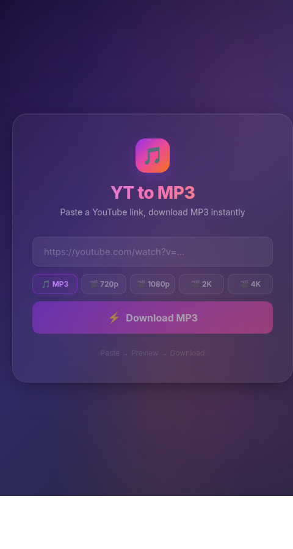

<div align="center">
  <br>
  <h1>🎵 YT → MP3/MP4</h1>
  <p><strong>Paste a YouTube link. Choose quality. Download. That's it.</strong></p>
  <br>
  <p>
    
    
    
    
  </p>
  <br>
  
  <br><br>
</div>

A sleek, full-stack YouTube downloader that converts videos to **MP3 audio** or **MP4 video** up to **4K quality**. Runs locally — no third-party services, no ads, no limits.

---

## ✨ Features

| | |
|---|---|
| 🎯 **Paste & Download** | Paste any YouTube link, get your file in seconds |
| 🎵 **MP3 Audio** | High-quality audio extraction (192kbps) |
| 🎬 **HD Video** | Choose 720p, 1080p, **2K**, or **4K** |
| 🖥️ **Beautiful UI** | Vibrant glassmorphism design with live progress |
| ⚡ **Real-time Progress** | See download percentage and conversion status |
| 🛡️ **100% Private** | Everything runs locally on your machine |
| 🆓 **Free & Open Source** | No limits, no paid tiers, no API keys needed |

---

## 📋 Requirements

| Tool | Why | Install |
|---|---|---|
| **Node.js** 18+ | Runs the server | [nodejs.org](https://nodejs.org) |
| **ffmpeg** | Audio/video processing | `pacman -S ffmpeg` · `apt install ffmpeg` · `brew install ffmpeg` |
| **yt-dlp** | Downloads from YouTube | `pip3 install -U yt-dlp` |

---

## 🚀 Quick Start

```bash
# 1. Clone the repo
git clone https://github.com/abnormal-yi/localtube.git
cd localtube

# 2. Install dependencies
npm install

# 3. Start the server
node server.js
```

**Open [`http://localhost:3000`](http://localhost:3000)** and you're ready to go.

---

## 🎮 How to Use

```
1. Open the app in your browser
2. Choose your format — MP3, 720p, 1080p, 2K, or 4K
3. Paste a YouTube link
4. Click download
5. ✅ File saves to ~/Downloads/yt-mp3/
```

---

## 🧩 API (for developers)

### `POST /api/convert`

Convert a YouTube video to audio or video.

**Request:**

```json
{
  "url": "https://youtube.com/watch?v=dQw4w9WgXcQ",
  "format": "mp4-1080"
}
```

**Response:**

```json
{
  "url": "/downloads/Rick Astley - Never Gonna Give You Up.mp4",
  "title": "Rick Astley - Never Gonna Give You Up",
  "ext": "mp4"
}
```

**Available formats:**

| Parameter | Output |
|---|---|
| `mp3` | Audio (MP3, 192kbps) |
| `mp4-720` | Video (720p HD) |
| `mp4-1080` | Video (1080p Full HD) |
| `mp4-1440` | Video (2K) |
| `mp4-2160` | Video (4K) |

### `GET /api/progress`

Poll download progress during conversion.

```json
{
  "progress": "Downloading... 67.3%"
}
```

---

## 🛠 Tech Stack

| Layer | Technology |
|---|---|
| **Frontend** | Vanilla HTML + CSS + JS (no frameworks) |
| **Backend** | Node.js + Express |
| **Downloader** | yt-dlp + ffmpeg |
| **Design** | Glassmorphism, animated gradients |

---

## 📦 Deployment

Deploy on any VPS or cloud server:

```bash
# Install dependencies
sudo apt install nodejs ffmpeg python3-pip
pip3 install yt-dlp

# Run (use pm2 for persistence)
npm install -g pm2
pm2 start server.js --name localtube
pm2 save
```

Works great on **Railway**, **Render**, **Fly.io**, or any **$6/mo VPS**.

---

<div align="center">
  <br>
  <p>
    <a href="https://github.com/abnormal-yi/yt-mp3-downloader/issues">🐛 Report Bug</a>
    ·
    <a href="https://github.com/abnormal-yi/yt-mp3-downloader/issues">💡 Request Feature</a>
    ·
    <a href="https://github.com/abnormal-yi/yt-mp3-downloader">⭐ Star on GitHub</a>
  </p>
  <p><sub>Built with ❤️ by <a href="https://github.com/abnormal-yi">abnormal-yi</a></sub></p>
  <br>
</div>
